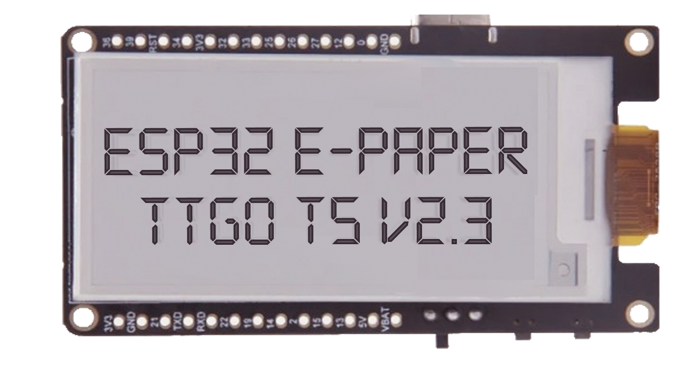
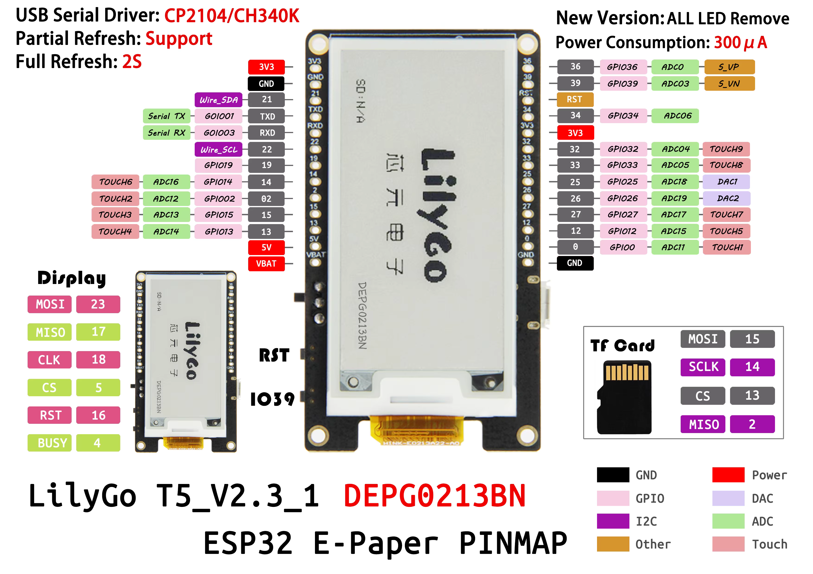

 

  
## A spot for all things TTGO T5 (2.13in)

<b>Prepare to delve into a treasure trove of innovation! Within this repository, I'll be infusing a rich tapestry of IDE sketches, supplemented with comprehensive documentation and supplementary materials. 

 

Expect to uncover a wealth of insights tailor-made for the captivating 2.13-inch TTGO T5 ESP32 E-Paper display.

---

Before diving into the projects you should take a look at the lib section and install the required libs.

## 📁 Repo Directory 📁

- <a href=>Arduino library Files</a>
- <a href=>TTGO T5 Projects</a>

 

---

## GPIO Pinout

(Credit to the orginal copywrite creator)

 

---
  
### Device Compatibility

These sketches Successfully tested on
- [T5 2.13inch E-Paper Development Board](https://www.aliexpress.us/item/2251832683415218.html?spm=a2g0o.order_list.order_list_main.5.55451802fBAW2R&gatewayAdapt=glo2usa)
